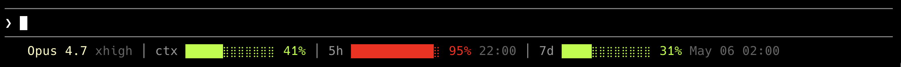

# cc-statusline

A clean statusline for [Claude Code](https://docs.anthropic.com/en/docs/claude-code).

It shows your current model, context usage, and rate-limit windows directly in the Claude Code statusline.



```text
Opus xhigh │ ctx        ⣿⣿⣿⣿⣿ 58% │ 5h          ⣿⣿ 76% 22:00 │ 7d    ⣿⣿⣿⣿⣿⣿⣿⣿ 29% May 06 02:00
```

## Install

### npm

Works on macOS, Linux, and Windows.

```bash
npm install -g cc-statusline-cli
cc-statusline install
```

The npm package uses the Node.js runtime and does not require Bash or `jq`. It does not run a `postinstall` script, which keeps npm lifecycle scripts disabled-friendly and avoids writing Claude Code settings during package installation. Run `cc-statusline install` after `npm install` to register the statusline in Claude Code.

On Windows, run the same commands from PowerShell or CMD. The installer writes to `%USERPROFILE%\.claude\settings.json`.

### Homebrew

Homebrew install is for macOS only. It needs two steps: install the formula, then run `cc-statusline configure` to wire `~/.claude/settings.json`.

```bash
brew tap tenondecrpc/tap
brew install cc-statusline-cli
cc-statusline configure
```

The configure step is required because macOS TCC blocks Homebrew's `post_install` from writing under `~/.claude/`, so the formula cannot register the statusline by itself.

Replace an existing custom statusline:

```bash
cc-statusline configure --force
```

Keep an existing custom statusline (only install files, leave settings.json alone):

```bash
cc-statusline configure --keep-existing
```

`cc-statusline configure` creates a backup of `~/.claude/settings.json` before changing it. After registration, restart Claude Code or open a new session for the statusline to appear.

## Requirements

- npm install: Node.js 18+. Bash and `jq` are not required.
- Homebrew install: Bash 3.2+ and `jq` 1.6+
- `git` for repository status

`jq` is only needed by the Homebrew/Bash runtime. It is not included with macOS by default, but Homebrew installs it automatically as a dependency. The npm install does not need `jq`.

## Help

```bash
cc-statusline help
cc-statusline version
cc-statusline install --force
```

## Uninstall

Run `cc-statusline uninstall` to restore your previous `settings.json` backup and remove the npm package in one step:

```bash
cc-statusline uninstall
```

If you only want to clean the `statusLine` entry without removing the package:

```bash
cc-statusline uninstall --keep-package
```

Add `--purge` to also remove the user config directory (`~/.config/cc-statusline`):

```bash
cc-statusline uninstall --purge
```

For Homebrew, restore your previous `settings.json` from the backup before uninstalling, otherwise Claude Code will reference a missing script:

```bash
# pick the most recent backup, or remove the .statusLine entry by hand
ls -t ~/.claude/settings.json.bak.* | head -1
cp ~/.claude/settings.json.bak.YYYYMMDD-HHMMSS ~/.claude/settings.json
brew uninstall cc-statusline-cli
```

## License

MIT
